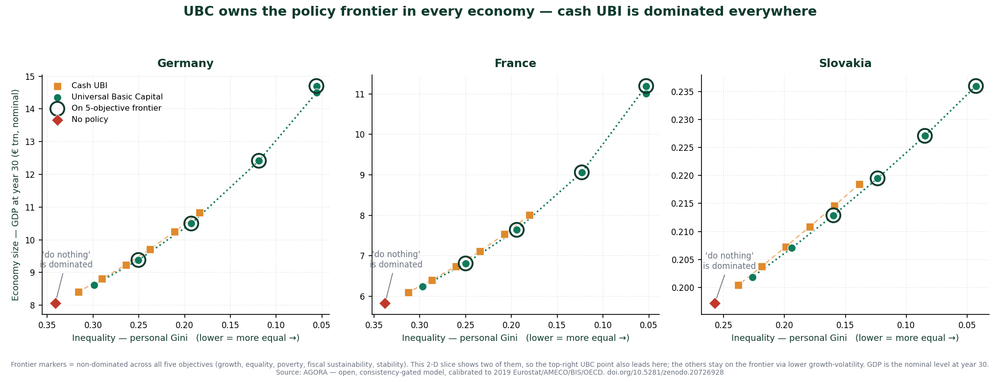

# AGORA — a sandbox for the economics of abundance

[](https://doi.org/10.5281/zenodo.20726928)
[](https://creativecommons.org/licenses/by/4.0/)


**AGORA** is an open, **stock-flow-consistent** model of the European economy built
to answer one question rigorously: *as AI raises productivity, who gets the gains —
and which policies actually share them?* It compares policies (cash UBI vs
**Universal Basic Capital**) inside one accounting-complete world, calibrated to
live data and validated against history.

> **Sandbox, not oracle.** AGORA produces *scenario comparisons under explicit,
> swappable assumptions* — not forecasts. Every parameter is inspectable and
> sourced; every scenario must pass a consistency gate (no money created or lost
> in the accounts) before any result is reported.

📄 **Read the study:** *Owning the Machine — A Governance of Abundance for Europe* (12 pp) → [`AGORA_Manifesto.pdf`](AGORA_Manifesto.pdf) · permanent copy: https://doi.org/10.5281/zenodo.20726928 · SSRN: (forthcoming)
📋 **One-page policy brief:** [`AGORA_Policy_Brief_UBC.pdf`](AGORA_Policy_Brief_UBC.pdf) — practical paths to implement UBC and where the capital comes from.
🔗 **Live dashboard:** https://brano80.github.io/agora/

---

## The headline result


Under an AI labour-share shock (Germany, 30-year scenario):
- **Cash UBI** lowers income inequality but leaves the **top-10% wealth share ~56%** — it redistributes the income capital throws off, never the capital.
- **Universal Basic Capital** (a citizens' fund paying a per-capita dividend) collapses it to **~20%** — it distributes the asset itself.
- With fund **reinvestment**, the UBC economy ends *larger* than the cash economy — predistribution needn't cost growth.
- A **pooled EU dividend** roughly **halves** between-country inequality.
- Across a multi-objective frontier, **UBC policies dominate** both cash UBI and inaction.



*At equal cost, Universal Basic Capital is non-dominated across all five objectives (growth, equality, poverty, fiscal sustainability, stability); cash UBI and “do nothing” are dominated everywhere. Per-country charts: [DE](AGORA_frontier_DE.png).*

## How it's built
- **Stock-flow-consistent core** + pluggable modules (distribution · input-output · AI-shock · citizens' fund · multi-region) through a common schema.
- **Live data:** Eurostat national accounts, AMECO wage shares, BIS household debt, OECD wealth distribution, Eurostat **FIGARO** input-output — integrated via DBnomics; 26 EU members calibrated.
- **Validated:** back-tested to 2010–2019 history (~2.3% mean GDP error; government-debt path within the 10% bound); a consistency gate enforced on every run (residuals ~1e-10 of GDP); **241 automated tests**.
- Pure standard-library Python engine.

## Drive it in plain language (MCP + agent crew)

AGORA runs as an **MCP server**, so any AI assistant — Claude Desktop, Claude Code,
VS Code — can drive the model directly, and a small **agent crew** turns a
plain-language request into a gated, reported run. Ask in words:

> *"Compare cash UBI vs UBC under an AI shock in Slovakia"*
> *"What's the policy trade-off frontier for Germany?"*
> *"Run an AI shock with UBC at 40% in France"*

The crew plans the request, resolves the assumptions for your approval, runs it
through the consistency gate, and reports the result — a single scenario, a
comparison, or the Pareto frontier — always with the numbers and **never a
"winner"** (the values judgement stays with you). It runs offline with no LLM:

```bash
python agent_crew.py "What's the policy frontier for Germany under an AI shock?"
```
```
AGORA crew -- policy frontier on DE (30y). 4 non-dominated policies out of 13;
no single 'best' -- each trades one objective for another.
  - UBC t=20%: GDP 9,382,116, Gini 0.250, poverty 0.090, debt/GDP 143.
  - UBC t=30%: GDP 10,496,531, Gini 0.193, poverty 0.016, debt/GDP 136.
  - UBC t=40%: GDP 12,414,605, Gini 0.119, poverty 0.000, debt/GDP 125.
  - UBC t=50%: GDP 14,699,402, Gini 0.056, poverty 0.000, debt/GDP 118.
  Sandbox, not a forecast; every candidate passed the consistency gate.
```

**Why it's trustworthy as a tool** — the guardrails live in the tool layer, not
the wrapper: every result passes the stock-flow consistency gate before it
leaves (a failing scenario returns the failing checks and *no numbers*, with no
switch to disable it); every payload carries its assumptions and data provenance;
the comparison tools have no "winner" field; and AGORA bundles **no model of its
own** — optional narration borrows the client's model via MCP sampling.

10 read-only MCP tools (`agora_run_scenario`, `agora_compare`,
`agora_policy_frontier`, `agora_preview_scenario`, `agora_narrate`, `agora_crew`,
…). Connect it:
```bash
pip install "mcp[cli]"
# then add mcp_server.py to claude_desktop_config.json (see docs/MCP.md)
```
Full tool list + setup: [`docs/MCP.md`](docs/MCP.md) · crew design: [`docs/PHASE5.md`](docs/PHASE5.md).

## Quickstart
```bash
python -m pytest tests/ -q              # run the test suite (241)
python -m streamlit run dashboard/app.py # explore scenarios
python scripts/run_triad.py --geo DE     # baseline / AI-shift / settlement
```

## Repository map
- `schema/` canonical SNA accounts · `modules/` model adapters · `consistency/` the gate
- `data/` live connectors + cached snapshots · `orchestrator.py` · `scenarios.py`
- `docs/` architecture, manifesto, findings · `tests/`

## Citation
```bibtex
@misc{agora2026,
  title  = {Owning the Machine: A Governance of Abundance for Europe},
  author = {Branislav Ambroz},
  year   = {2026},
  note   = {AGORA — an open, consistency-gated model of AI's distributional impact},
  doi    = {10.5281/zenodo.20726928},
  url    = {https://doi.org/10.5281/zenodo.20726928}
}
```

## License
Code & documents: **CC BY 4.0** (attribution). See `LICENSE`.

---
*AGORA is a research preview. It is a tool for comparing policies transparently — not investment, legal, or policy advice.*
