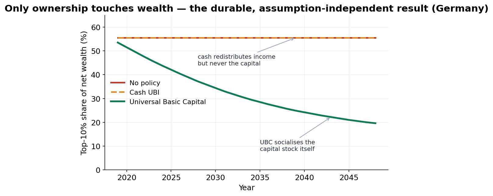

# AGORA — a sandbox for the economics of abundance

[](https://doi.org/10.5281/zenodo.20726928)
[](https://creativecommons.org/licenses/by/4.0/)


**AGORA** is an open, **stock-flow-consistent** model of the European economy built
to answer one question rigorously: *as AI raises productivity, who gets the gains —
and which policies actually share them?* It compares policies (cash UBI vs
**Universal Basic Capital**) inside one accounting-complete world, calibrated to
live data and validated against history.

> **Sandbox, not oracle.** AGORA produces *scenario comparisons under explicit,
> swappable assumptions* — not forecasts. Every parameter is inspectable and
> sourced; every scenario must pass a consistency gate (no money created or lost
> in the accounts) before any result is reported.

📄 **Read the study:** *Owning the Machine — A Governance of Abundance for Europe* (12 pp) → [`AGORA_Manifesto.pdf`](AGORA_Manifesto.pdf) · permanent copy: https://doi.org/10.5281/zenodo.20726928 · SSRN: (forthcoming)
🔗 **Live dashboard:** https://brano80.github.io/agora/

---

## The headline result


Under an AI labour-share shock (Germany, 30-year scenario):
- **Cash UBI** lowers income inequality but leaves the **top-10% wealth share ~56%** — it redistributes the income capital throws off, never the capital.
- **Universal Basic Capital** (a citizens' fund paying a per-capita dividend) collapses it to **~20%** — it distributes the asset itself.
- With fund **reinvestment**, the UBC economy ends *larger* than the cash economy — predistribution needn't cost growth.
- A **pooled EU dividend** roughly **halves** between-country inequality.
- Across a multi-objective frontier, **UBC policies dominate** both cash UBI and inaction.

## How it's built
- **Stock-flow-consistent core** + pluggable modules (distribution · input-output · AI-shock · citizens' fund · multi-region) through a common schema.
- **Live data:** Eurostat national accounts, AMECO wage shares, BIS household debt, OECD wealth distribution, Eurostat **FIGARO** input-output — integrated via DBnomics; 26 EU members calibrated.
- **Validated:** back-tested to 2010–2019 history (~1% GDP error); a consistency gate enforced on every run (residuals ~1e-10 of GDP); **192 automated tests**.
- Pure standard-library Python engine.

## Quickstart
```bash
python -m pytest tests/ -q              # run the test suite (192)
python -m streamlit run dashboard/app.py # explore scenarios
python scripts/run_triad.py --geo DE     # baseline / AI-shift / settlement
```

## Repository map
- `schema/` canonical SNA accounts · `modules/` model adapters · `consistency/` the gate
- `data/` live connectors + cached snapshots · `orchestrator.py` · `scenarios.py`
- `docs/` architecture, manifesto, findings · `tests/`

## Citation
```bibtex
@misc{agora2026,
  title  = {Owning the Machine: A Governance of Abundance for Europe},
  author = {Branislav Ambroz},
  year   = {2026},
  note   = {AGORA — an open, consistency-gated model of AI's distributional impact},
  doi    = {10.5281/zenodo.20726928},
  url    = {https://doi.org/10.5281/zenodo.20726928}
}
```

## License
Code & documents: **CC BY 4.0** (attribution). See `LICENSE`.

---
*AGORA is a research preview. It is a tool for comparing policies transparently — not investment, legal, or policy advice.*
